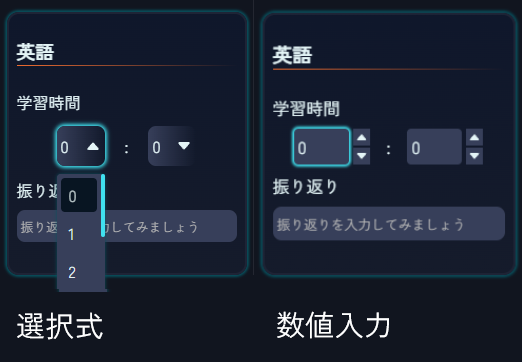

# パッチノート

## Ver.0.1.3
**記録画面のアップデート**
+ 教科カラーのアクセントを追加しました.
+ スマホ表示での総学習時間のレイアウトを修正しました.
+ 選択式入力を追加しました.

**カウントダウンタイマーの実装**
+ カウントダウンを利用できるようになりました.

**タイマーの不具合修正**
+ 数字のチラつきを修正しました.

**設定画面の追加**
+ 数値入力と選択式入力の設定を追加しました.
+ カウントダウンタイマーのアラーム音量を追加しました.

## Ver.0.1.2
**PWA版実装**
+ PWAとしてインストールできるようになりました. ホーム画面トップのバナーからインストールできます.

**バグ修正**
+ AIのメッセージやログインカウンターのアニメーションが遅くなる問題を修正しました

## Ver.0.1.1
**月間カレンダーのアップデート**
+ **AIが一ヶ月の学習記録をまとめてくれるようになりました!**
+ カレンダーの一週目において,色を決定するアルゴリズムが正しく動作していない問題を修正しました.
+ 色を決定するアルゴリズムを変更しました
+ カレンダーのマスをタップ,またはカーソルを合わせると学習時間が表示されるようにしました
+ カレンダーの上部に一ヶ月の総学習時間が表示されるようにしました.

**ソーシャル画面の追加**
+ 現在開発中ですので, 実装までしばらくお待ちください

**AI機能のアップデート**
+ ログインメッセージの出力を調整しました.
+ 月間カレンダーにAIを追加しました.

## Ver 0.1.0
ACTIONを公開しました.